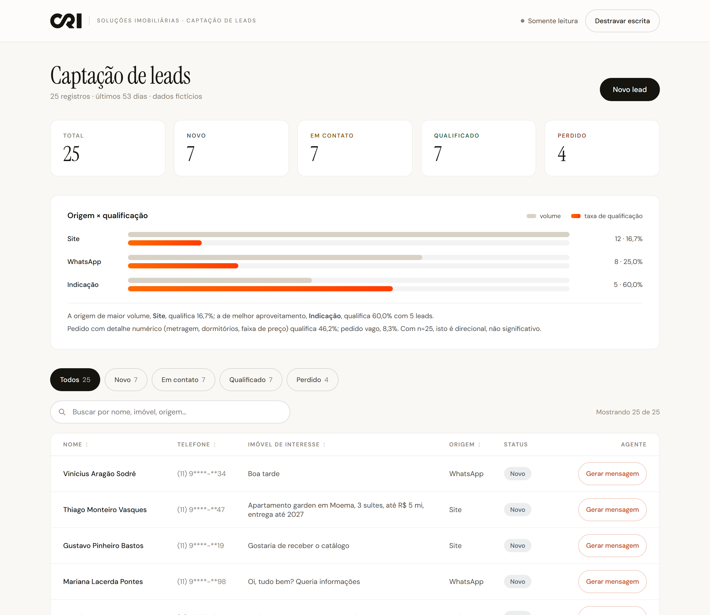
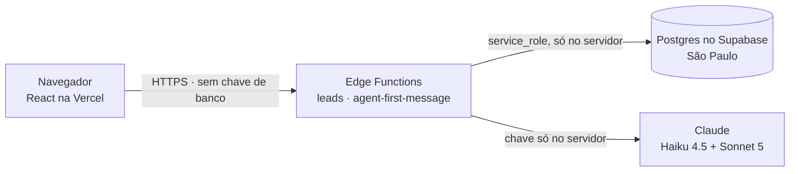
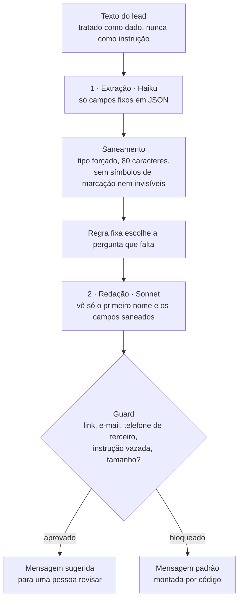

<div align="center">

# CRI Leads

**Mini sistema de captação de leads, do banco de dados à automação com IA.**
Case técnico · Desenvolvedor(a) Jr, Agentes de IA · CRI Soluções Imobiliárias

[**Abrir a interface**](https://cri-leads.vercel.app) ·
[**Documentação da entrega**](DOCUMENTACAO.md) ·
[**Segurança**](SECURITY.md) ·
[**Análise dos dados**](analytics/resultados.md)

</div>



> Projeto de avaliação técnica, não é um sistema oficial da CRI. Todos os dados são fictícios.

---

## O que tem aqui

| Etapa | O que foi feito | Onde |
|---|---|---|
| **1 · Banco** | Tabela `leads` com RLS e permissões mínimas, 25 leads fictícios | [`supabase/migrations/`](supabase/migrations) |
| **2 · Dados** | 3 consultas SQL com o resultado real e a leitura | [`analytics/`](analytics) |
| **3 · Interface** | Lista, filtro por status, busca, ordenação, resumo visual | [cri-leads.vercel.app](https://cri-leads.vercel.app) · [`src/`](src) |
| **4 · Agente** | Sugere a 1ª mensagem ao lead, com defesa contra prompt injection | [`supabase/functions/agent-first-message/`](supabase/functions/agent-first-message) |
| **5 · Documentação** | O que, por quê, dificuldades e próximos passos, etapa a etapa | [`DOCUMENTACAO.md`](DOCUMENTACAO.md) |

## Em números

| | |
|---|---|
| Origem com mais leads | **Site**, 12 de 25 (48%) |
| Taxa de qualificação | Indicação **60%** · WhatsApp 25% · Site **16,7%** |
| Pedido detalhado × vago | **46,2%** × **8,3%** qualificados |
| Agente | ~3,5 s e menos de meio centavo de dólar por mensagem ([medido em `agent_runs`](DOCUMENTACAO.md#etapa-4--agente-de-automação)) |
| Testes | **97** nas regras de negócio e de segurança, mais verificação da API publicada |

## Como funciona



O navegador não recebe nenhuma credencial de banco. A leitura é aberta para a avaliação; criar lead,
mudar status e gerar mensagem exigem a chave de demonstração enviada no e-mail. Detalhes, e o que
isso **não** protege, em [SECURITY.md](SECURITY.md).

### O agente é uma linha de montagem



O texto que o lead escreveu sobre o imóvel nunca chega ao passo que redige: esse passo vê só o
primeiro nome e os campos já saneados. Uma tentativa de injeção consegue, no máximo, sujar
um campo curto e já higienizado, e a saída ainda passa pelo guard. O sistema **nunca envia** nada:
a mensagem é sempre uma sugestão para a equipe revisar.

## Stack

| | |
|---|---|
| Banco e API | Supabase: Postgres + Edge Functions (Deno) |
| Interface | React 19, TypeScript, Vite, CSS próprio |
| IA | API da Anthropic: Claude Haiku 4.5 (extração) e Sonnet 5 (redação) |
| Deploy | Vercel, com deploy automático a cada push |
| Testes | Vitest nas regras puras + script de verificação da API publicada |

## Rodando localmente

```bash
npm install
npm run dev        # http://localhost:5173
```

Sem configurar nada, a interface roda em **modo local**: uma API em memória com os 25 leads e as
mesmas regras reais do servidor (validação, resumo, guard). Para apontar para uma API de verdade,
copie `.env.example` para `.env.local` e preencha `VITE_API_BASE_URL`.

```bash
npm test           # 97 testes das regras
npm run typecheck
npm run build
npm run smoke      # verifica a API publicada (-- --agente inclui o teste de injeção)
```

<details>
<summary><strong>Subindo o próprio backend</strong></summary>

1. Crie um projeto no Supabase e rode, no SQL Editor e em ordem, os arquivos de
   `supabase/migrations/`.
2. Grave os segredos das functions (modelo em `supabase/functions/.env.example`):
   `DEMO_WRITE_KEY`, `ANTHROPIC_API_KEY` e `ALLOWED_ORIGINS`.
   ```bash
   npx supabase secrets set --env-file supabase/functions/.env --project-ref <ref>
   npx supabase functions deploy --project-ref <ref>
   ```
3. Aponte `VITE_API_BASE_URL` para `https://<ref>.supabase.co/functions/v1`.

</details>

## Estrutura

```
src/                         interface (React)
supabase/
  migrations/                tabelas, permissões e seed, em SQL
  functions/
    _shared/                 regras puras: rodam no servidor, na tela e nos testes
    _server/                 código só do servidor: banco, IA, CORS, chave
    leads/                   GET · POST · PATCH /leads
    agent-first-message/     o agente
analytics/                   consultas da Etapa 2 e a leitura
design/                      protótipo aprovado antes do React
scripts/smoke-api.mjs        verificação da API publicada
```

A pasta `_shared` guarda a **única implementação** de cada regra (validação, números da análise,
máscara de telefone, guard). Tela, servidor e testes importam o mesmo código, então concordam por
construção.

---

<sub>Construído com Claude Code: plano aprovado antes de cada mudança, revisão por um agente
separado e testes nas regras. Detalhes em [DOCUMENTACAO.md](DOCUMENTACAO.md#como-usei-ia-para-construir).</sub>
